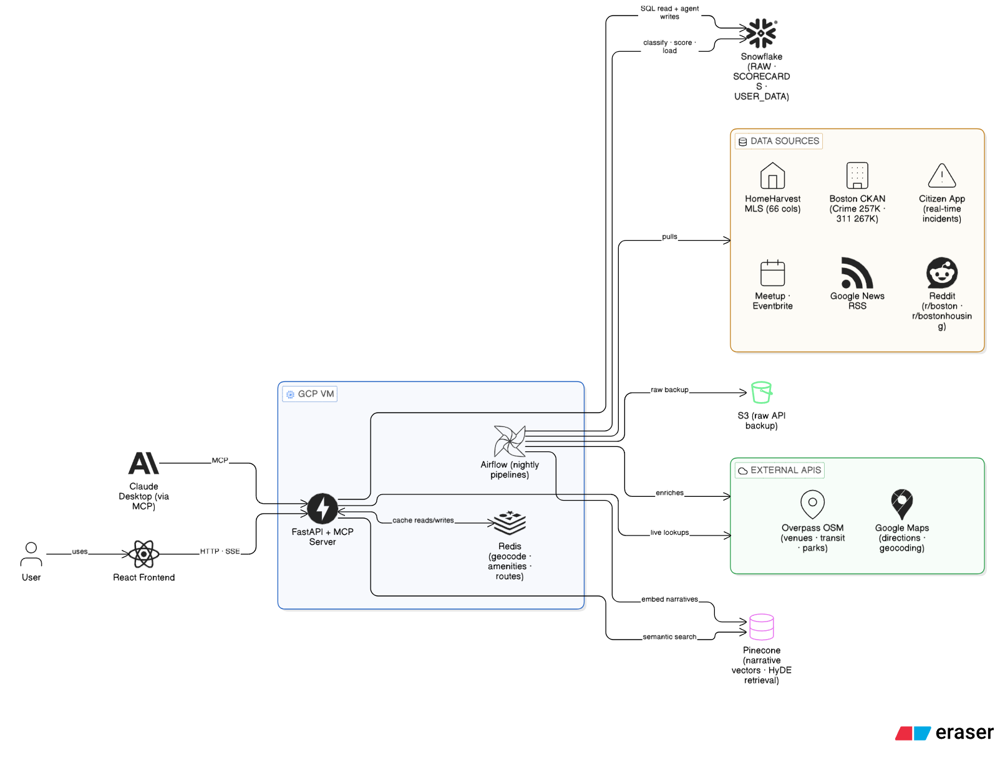
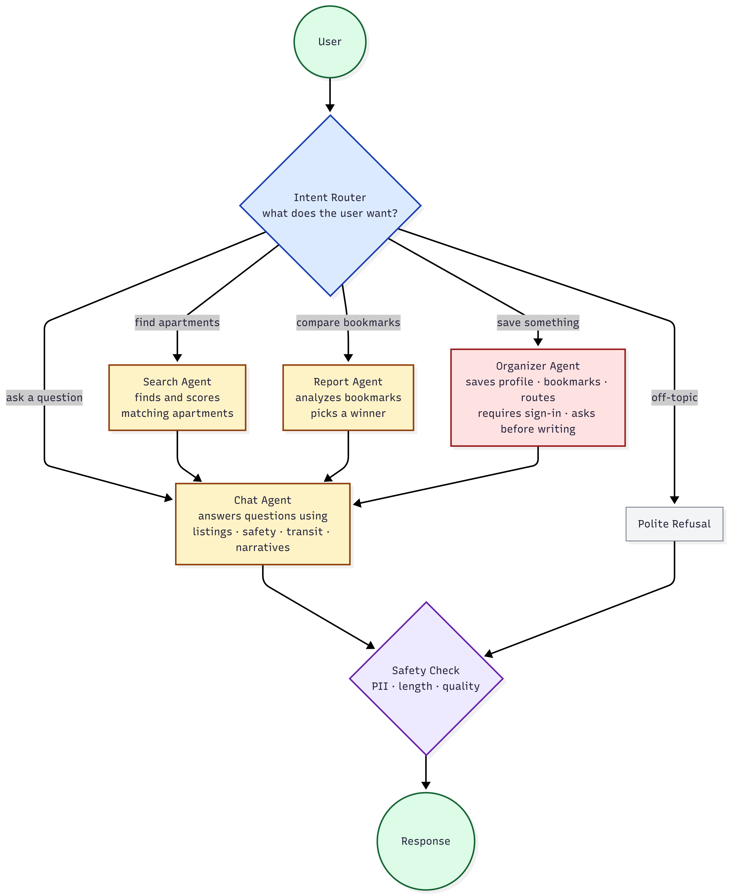
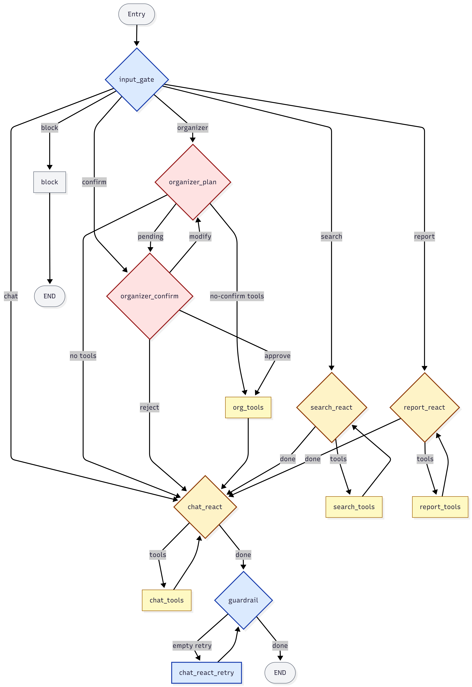

# Vicinity — Boston Housing Intelligence

A multi-agent system that helps people find safe, livable apartments in Boston. It pulls twelve public data sources into a single intelligence layer, scores every active listing across safety, livability, and transit, monitors bookmarks over a watch period, and answers natural-language questions with evidence drawn from both structured records and narrative sources like Reddit and local news.

| Resource | Link |
|---|---|
| Live Demo | |
| Docs | |
| Airflow UI | |
| Video | |
| Codelabs | |

**DAMG 7245 — Big Data and Intelligent Analytics**

| Member | Contribution |
|---|---|
| Anirudh Raj | 33.3% |
| Minal Naranje | 33.3% |
| Janhavi Patil | 33.3% |

**Attestation:** WE ATTEST THAT WE HAVEN'T USED ANY OTHER STUDENTS' WORK IN OUR ASSIGNMENT AND ABIDE BY THE POLICIES LISTED IN THE STUDENT HANDBOOK.

**AI usage:** Claude Opus 4.6 alongside GitHub Copilot. Used for agent graph design, prompt engineering, pipeline orchestration patterns, test scaffolding, and documentation.

---

## What it does

Vicinity answers the question "where should I live in Boston" with evidence accumulated over time rather than a single snapshot. A user enters their budget, preferred neighborhoods, and lifestyle priorities. Vicinity returns matching listings ranked by pre-computed scores, lets them bookmark candidates, and runs a monitoring pipeline over the following days or weeks. When the watch period ends, a comparison report weighs the accumulated evidence and picks a winner with justification.

The system understands four broad kinds of requests:

1. **Search.** Find apartments matching budget, bedrooms, neighborhood, and lifestyle preferences, ranked by safety, livability, and transit scores.
2. **Ask.** Answer questions about a neighborhood, listing, or trend using structured data (crime counts, complaint density, amenity coverage) alongside narrative evidence from Reddit, Google News, and Citizen.
3. **Save.** Create or update a profile, bookmark listings, add commute routes, or trigger monitoring for a new topic. Every write requires explicit confirmation.
4. **Compare.** At the end of a watch period, generate a side-by-side report across bookmarked listings with cited evidence and a recommendation.

---

## System Architecture



Vicinity runs on a single **GCP Compute Engine** VM with four long-running containers.

**Application layer**

* **FastAPI server.** REST API used by the React frontend, handles the agent graph's conversational endpoints.
* **MCP server.** Exposes the same agent tools through the Model Context Protocol. Runs in streamable-HTTP mode on port 8001 for clients that support HTTP-based MCP configs (Cursor and similar). Claude Desktop does not currently support remote HTTP MCP servers, so to connect it the MCP server is run locally over stdio instead. Both transports expose the exact same tool set; only the transport layer differs.
* **React frontend.** Served by nginx on port 80. Consumes the streaming chat API, renders listing cards, the comparison report, and the map.
* **Redis.** Caches geocoding results, Overpass amenity lookups, and commute route computations, all of which have stable answers that would otherwise cost an external API call per query.
* **Airflow.** Orchestrates the nightly ingestion and scoring pipelines.

**Data plane**

* **Snowflake.** Holds all structured records: listings, crime, 311 complaints, user bookmarks, daily scorecards.
* **Pinecone.** Stores narrative embeddings (Reddit posts, news headlines, incident descriptions, Citizen reports) and serves them back through semantic search.
* **AWS S3.** Keeps raw API responses so that any future change to classification logic can replay the original inputs without re-fetching from upstream sources.

---

## Agent Architecture

The conversational layer is a multi-agent system built on **LangGraph**. Every user message flows through the same path: a router classifies the intent, one or more specialized agents do the work, and a guardrail checks the response before it leaves the system. State persists across turns through a checkpointer, which means flows that span multiple messages (like asking for confirmation before a write) survive across turns without the user losing their place.

### High-level flow



When a message arrives, an **Intent Router** reads the current message along with a short window of recent conversation and decides where to send it. There are five destinations.

The **Chat Agent** handles open-ended questions, anything from "tell me about Allston" to "what's the crime situation near this listing at night." It answers using a mix of structured SQL queries against Snowflake and semantic search against Pinecone for narrative evidence. This dual approach lets the same agent respond to "how many violent crimes happened near listing A this week" with exact numbers and to "what do people say about walking home late in Allston" with real quotes from real sources.

The **Search Agent** finds apartments. It filters the MLS catalog by budget, bedrooms, and neighborhood, ranks candidates by the pre-computed safety, livability, and transit percentiles, and returns polished listing cards. It runs only when the user explicitly asks for apartments; it does not fire on every message.

The **Report Agent** compares bookmarked listings at the end of a watch period. It pulls every daily scorecard from Snowflake, retrieves supporting narrative evidence from Pinecone, weighs the tradeoffs, and writes a recommendation with citations. This agent runs only when the user has at least two bookmarks.

The **Organizer Agent** is the only path that can write to the database. Saving a profile, bookmarking a listing, adding a commute route, or asking the pipeline to start monitoring a new topic all go through the Organizer. Before any write commits, the graph pauses and asks the user to approve, reject, or modify the proposed action. Anonymous users who try to save something are politely asked to sign in. Reads and search are fully available without an account.

The **Polite Refusal** path handles messages outside Vicinity's scope. Vicinity is a Boston housing assistant; questions about the weather in Paris are redirected back to the domain.

Regardless of which path runs, the final response passes through a **Safety Check** that scrubs personally identifiable information, truncates responses that exceed the length budget, and retries the agent with a nudge if the output came back empty. This is the single exit point of the system, which means every response gets the same safety envelope no matter which agent produced it.

### Detailed graph



The detailed diagram shows the exact node topology from `app/agents/graph.py`. Every box corresponds to a node; every arrow corresponds to an edge. Yellow nodes are agents that call an LLM. Faint yellow nodes are tool executors that run one or more tools and return results to their agent. Blue nodes are control-plane machinery. Red nodes handle writes and human approval.

A few design decisions are worth explaining because they show up across the graph.

**The input gate classifies every turn.** Rather than letting each agent decide whether a message is meant for it, a single classifier sees the current message plus the last three exchanges and emits a structured JSON route. This means routing logic lives in one place, behaves consistently, and can be tested in isolation. The gate also scrubs PII from user input before the classification LLM ever sees it, so sensitive information never enters the prompt.

**Each agent runs a bounded ReAct loop.** An agent calls an LLM, which may request one or more tool calls. The graph runs the tools, feeds the results back to the LLM, and loops. This continues until the LLM produces a final answer or a hard cap of 15 tool calls is hit. The cap prevents runaway loops from a confused model and keeps cost per turn bounded.

**Message sanitization sits at every agent's entry.** Conversations accumulate a history of messages, including tool calls and their results. Sometimes a run gets cut short (a tool-call limit fires, a crash happens mid-turn, a human rejects a write) and the history ends up with a "tool call" that has no matching "tool result." Most LLM APIs reject this inconsistent shape and throw an error. The `sanitize_messages` helper walks the message history before it reaches any LLM and strips any orphaned tool calls, so the graph recovers gracefully from partial failures. A user never sees a crash caused by state left over from a previous turn.

**Sub-agents hand off to the chat agent for final synthesis.** Search and Report produce structured results like listing cards, comparison tables, and recommendations. The chat agent is responsible for turning those structured results into a natural response, adding a short introduction, and suggesting a reasonable next step. This keeps the user-facing voice consistent regardless of which sub-agent ran.

**Writes are split into plan and confirm.** The Organizer first decides what it wants to do and describes it to the user, then pauses the graph and waits. When the user approves, the same write plan executes. When the user rejects, nothing happens. When the user modifies the request ("change the watch window from 7 days to 14"), the Organizer re-plans with the new instruction. The write tool only ever fires after explicit approval.

**The guardrail is the single exit.** Every response passes through the same four-step check: PII scrubbing, tool-health verification (if every tool call failed, the agent falls back to an honest "I couldn't retrieve that" message rather than hallucinating), empty-response retry with a nudge prompt, and length truncation. Having one exit means the safety contract is the same for every path the graph can take.

---

## Data Pipeline

Airflow's master DAG runs nightly at **06:00 UTC** with `catchup=False`. The scheduler never backfills missed runs. Three phases, gated between them.

**Preflight** runs before any task. It fails fast with a clear error if the infrastructure isn't ready.

* Snowflake connectivity + schema check (`RAW`, `SCORECARDS`, `USER_DATA` must exist).
* Required API keys present: `DEEPSEEK_API_KEY`, `OPENAI_API_KEY`, `PINECONE_API_KEY`.
* Playwright is importable (needed for scraping fallbacks).
* External endpoints reachable: `data.boston.gov`, `citizen.com`, `api.deepseek.com`.
* At least 500 MB free disk on the VM.
* Airflow pools (`scraping`, `api`, `compute`) are created if missing.

**Phase 1 — Ingest.** Ten pipelines run in parallel. Every pipeline is idempotent: records are deduplicated by content hash before insert, so a crash halfway through can be re-run without creating duplicates.

* **Crime** and **311 complaints** from Boston's CKAN data portal.
* **Citizen** real-time incident reports.
* **MLS listings** via HomeHarvest, with a **Craigslist** fallback for non-MLS listings like owner-listed sublets.
* **Reddit** and **Google News**, one pipeline each for livability topics (safety, noise, transit) and preference topics (food, gyms, nightlife).
* **Eventbrite** for local events.

**Gate between Phase 1 and Phase 2.** Enforces data quality before downstream work runs.

* At least five pipelines must have succeeded. (configurable)
* The listings pipeline must have succeeded (listings are load-bearing; without them, scoring has nothing to score).
* If the gate fails, Phases 2 and 3 are skipped and Slack posts an alert with links to the failed task logs.

**Phase 2 — Sync.** New narrative embeddings are pushed to Pinecone. Only signals that changed or are newly classified get embedded, so this phase short-circuits cleanly on quiet days.

**Phase 3 — Score.** Daily scorecards are computed for every active listing.

* Scorer queries crime incidents, 311 complaints, amenities, and transit stops within configurable radii.
* Listings ranked by percentile across each dimension.
* One row per listing per day written to `LOCATION_SCORECARD`.
* A denormalized snapshot updates `LISTING_SUMMARY`, which the search API reads.
* Every row carries a confidence value, a year-over-year change where data allows, and a `scoring_metadata` blob with full provenance (exact radii, windows, and weights used). A low score with low confidence likely means sparse data coverage, not actual bad conditions — the metadata makes that distinction explicit.

**Slack notifications** fire at four points in the pipeline lifecycle:

* Pipeline start.
* Task retry.
* SLA miss.
* Pipeline completion, with per-task breakdown.

Failed-task messages include the task name, attempt count, duration, and a direct link to the Airflow logs. The webhook is configured through `SLACK_WEBHOOK_URL`. If absent, the pipeline runs normally and notifications are silently skipped.
---

## Project Structure

```
vicinity/
├── app/
│   ├── agents/              LangGraph: chat, search, report, organizer, guardrails
│   │   ├── graph.py         StateGraph assembly, single source of truth for topology
│   │   ├── tools/           read_tools, search_tools, write_tools
│   │   └── ...
│   ├── pipelines/           Ingestion pipelines (crime, 311, listings, reddit, news, ...)
│   ├── scoring/             Percentile ranking, confidence, YoY, route corridor scoring
│   ├── routers/             FastAPI: chat, listings, users, health
│   ├── services/            Snowflake query services, user data, URL health
│   └── core/                Cache, config loader, base pipeline, auth
├── mcp_vicinity/            MCP server (streamable-HTTP transport)
├── airflow/
│   ├── dags/                vicinity_master + per-pipeline configs
│   └── dag_utils.py         Slack hooks, shared callbacks
├── config/                  agents.yml, scoring.yml, dags.yml, sources/
├── docker/                  Dockerfile.api, Dockerfile.frontend, docker-compose.yml
├── frontend/                React app
├── alembic/                 Snowflake schema migrations
├── infra/                   Terraform, Snowflake database, schemas, roles, grants
├── scripts/                 chat.py (terminal interface), utilities
├── tests/
│   ├── unit/                agents, routers, scoring (Hypothesis properties)
│   └── integration/         graph routing, HITL, sub-agent synthesis, sanitization
├── images/                  Architecture diagrams
├── Makefile                 Build, test, deploy
├── requirements.txt         Full deps (pipelines + app)
├── requirements-api.txt     Trimmed API-only deps
├── .env.example
└── deploy.env.example       GCP project, region, instance, zone
```

---

## Setup and Deployment

Python 3.12 is required. Deployment uses Google Cloud Platform with Compute Engine and Artifact Registry. You will need the `gcloud` CLI authenticated to your project.

### Configuration

Clone the repository and prepare the two environment files:

```bash
git clone https://github.com/<org>/vicinity.git
cd vicinity
cp .env.example .env
cp deploy.env.example deploy.env
```

Fill in `.env` with Snowflake credentials, `DEEPSEEK_API_KEY`, `OPENAI_API_KEY`, `PINECONE_API_KEY`, `GOOGLE_MAPS_API`, and `JWT_SECRET`. `SLACK_WEBHOOK_URL` and the AWS keys are optional. The `deploy.env` file holds GCP project, region, and instance details used by the Makefile.

### Local development

```bash
make up        # Redis, API, Frontend, MCP via docker-compose
make health    # verify all four services are up
make logs      # tail logs
make down      # stop the stack
```

Local endpoints land at Frontend `:3000`, API `:8000/docs`, MCP `:8001/mcp`, Redis `:6379`.

### Test

```bash
make test      # unit tests
make lint      # ruff, with auto-fix
make ci        # lint, test, then build all images
```

Unit tests cover routers, services, agents, and the scoring module, which uses Hypothesis for property-based tests against invariants like "percentile ranks are always in [0, 100]." Integration tests cover live graph routing, the HITL approve/reject/modify paths, sub-agent-to-chat synthesis, and message sanitization against deliberately poisoned state. Write tools are sentinel-intercepted during tests, so no row ever reaches Snowflake from a test run.

### Deploy to GCP

```bash
make all
```

This builds all images, pushes them to Artifact Registry, bundles the project, copies it to the VM, and brings up API, Redis, Frontend, MCP, and Airflow. It is idempotent. The VM is created if missing, firewall rules are created if missing, the Artifact Registry repo is created if missing, and the VM's external IP is promoted to static the first time it runs.

For everyday changes, the incremental commands are faster:

```bash
make redeploy      # rebuild, push, and redeploy the API only
make redeploy-fe   # rebuild, push, and redeploy the frontend only
make deploy-af     # redeploy Airflow only
```

Operational commands:

```bash
make status        # live health of every service on the VM
make ssh           # SSH into the VM
make expose-af     # open Airflow UI on port 8081
make hide-af       # close it again
```

The Airflow UI firewall is closed by default. Open it only when you need to inspect a run.

### The five commands you run daily

| Command | When |
|---|---|
| `make up` | Start the local stack |
| `make test` | Before every commit |
| `make redeploy` | Ship an API change to production |
| `make status` | Verify production health |
| `make all` | Full clean deploy from scratch |

---

## Observability

Every component binds `trace_id`, `session_id`, and `pipeline_run_id` through `structlog`. A single grep follows any request end to end across the agent graph, the tools it called, and the downstream services those tools hit. Each chat turn writes a row to `RAW.LLM_USAGE_LOG` with model, token counts, duration, and cost, sharing the same schema as pipeline-side LLM usage so both can be analyzed together. The `/healthz` endpoint verifies Snowflake, Redis, and Pinecone connectivity and is used by `make status` to probe the deployed VM. Airflow Slack notifications cover pipeline lifecycle events with log links.

---

## Key Technologies

| Layer | Stack |
|---|---|
| Agents | LangGraph, LiteLLM (DeepSeek primary, GPT-4o fallback) |
| API | FastAPI, Starlette SSE, MCP (streamable-HTTP) |
| Data | Snowflake, Pinecone, Redis, AWS S3 |
| Orchestration | Airflow, Docker Compose |
| Frontend | React, nginx |
| Cloud | GCP Compute Engine, Artifact Registry |
| IaC | Terraform (Snowflake provider) |
| Testing | pytest, pytest-asyncio, Hypothesis |

---

## Infrastructure as Code

Snowflake infrastructure is defined in Terraform under `infra/` using the `Snowflake-Labs/snowflake` provider with local state. Terraform manages the `VICEV` database and its three schemas (`RAW`, `SCORECARDS`, `USER_DATA`), the `VICINEV` warehouse with auto-suspend, the application service user, and two roles with carefully scoped grants.

The two-role split matters. The application role (`VICIN_DEV`) has full read and write access on all three schemas, and is used by FastAPI routers and Airflow pipelines. The read-only role (`VICINITY_RAG_READONLY_DEV`) has `SELECT` on current and future tables and views, nothing more, and is used by the chat agent's SQL templates. This means a prompt injection attempting to run `DROP TABLE` fails at the Snowflake permission layer, not just at the prompt-engineering layer. Defense in depth rather than defense by prompt.

Both roles use `FUTURE` grants, so any new table or view created later automatically inherits the right permissions without a Terraform re-apply for every schema change.

```bash
cd infra
terraform init
terraform plan  -var-file=dev.tfvars
terraform apply -var-file=dev.tfvars
```